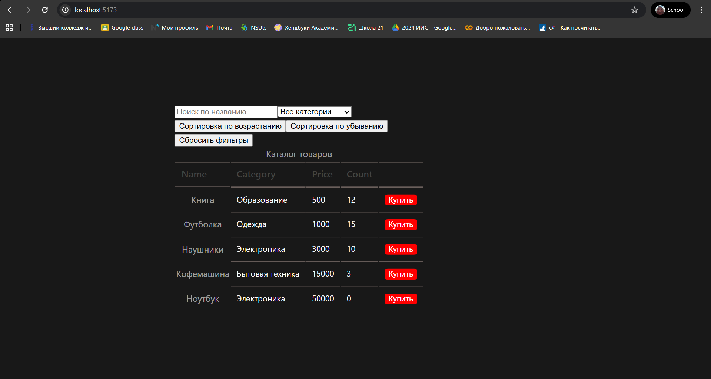
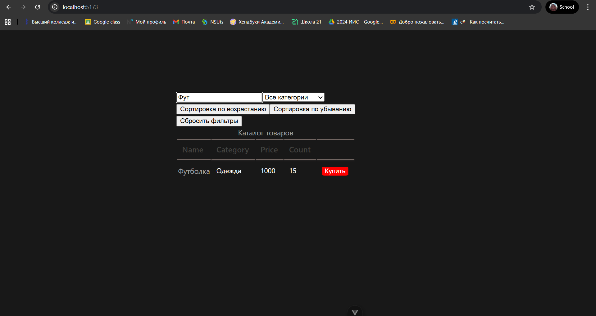
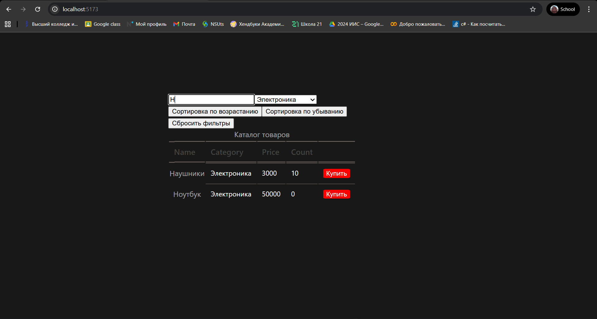
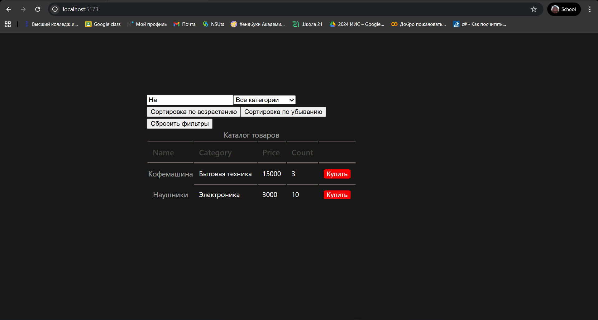
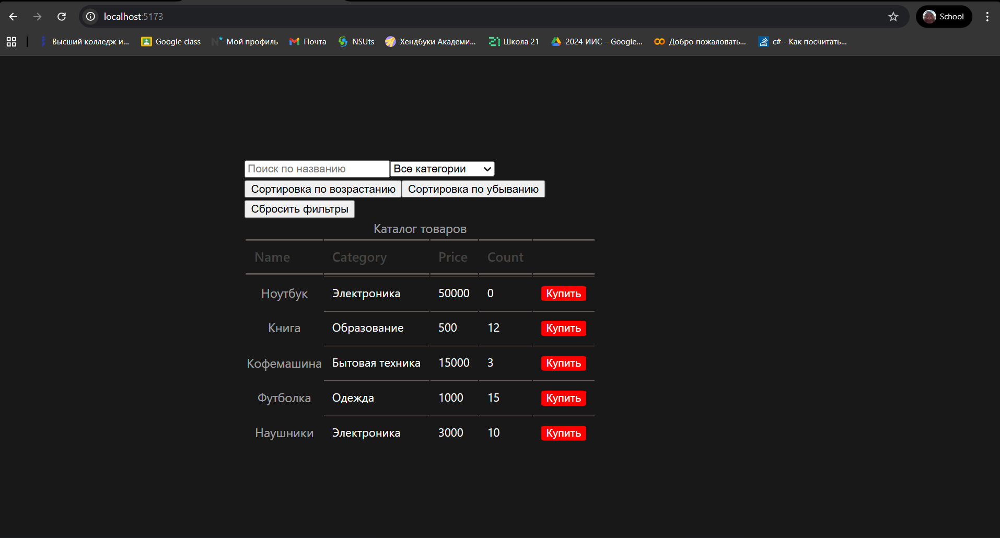
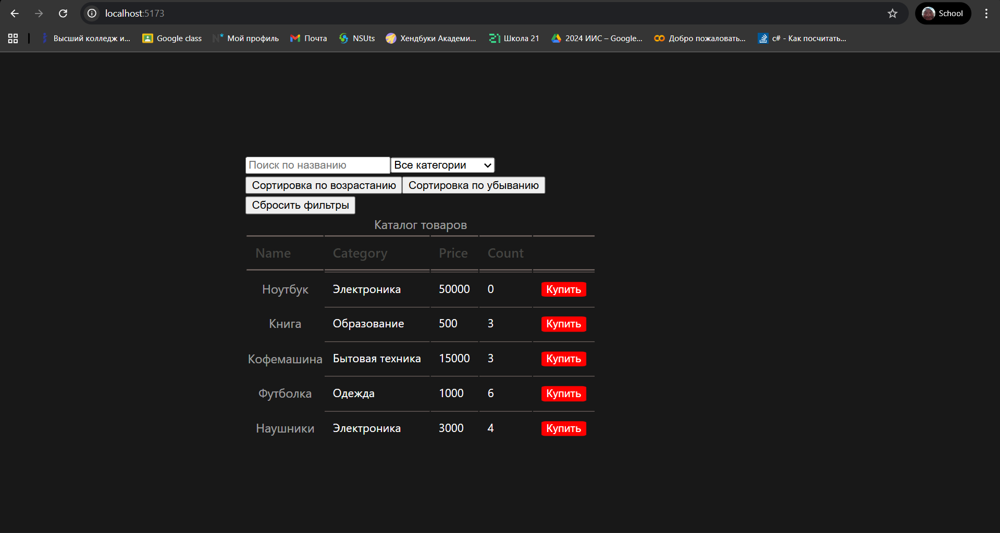

# ProductVue

Интерфейс для отображения каталога товаров, с возможностью фильтрации, сортировки и поиска.

## Пример работы приложения


Проверка поиска


Проверка фильтрации


Проверка сортировок




Проверка сброса фильтров


Проверка покупок


Проверка localStorage
Перезагрузка...

## Project Setup

```sh
npm install
```

### Compile and Hot-Reload for Development

```sh
npm run dev
```

### Compile and Minify for Production

```sh
npm run build
```
